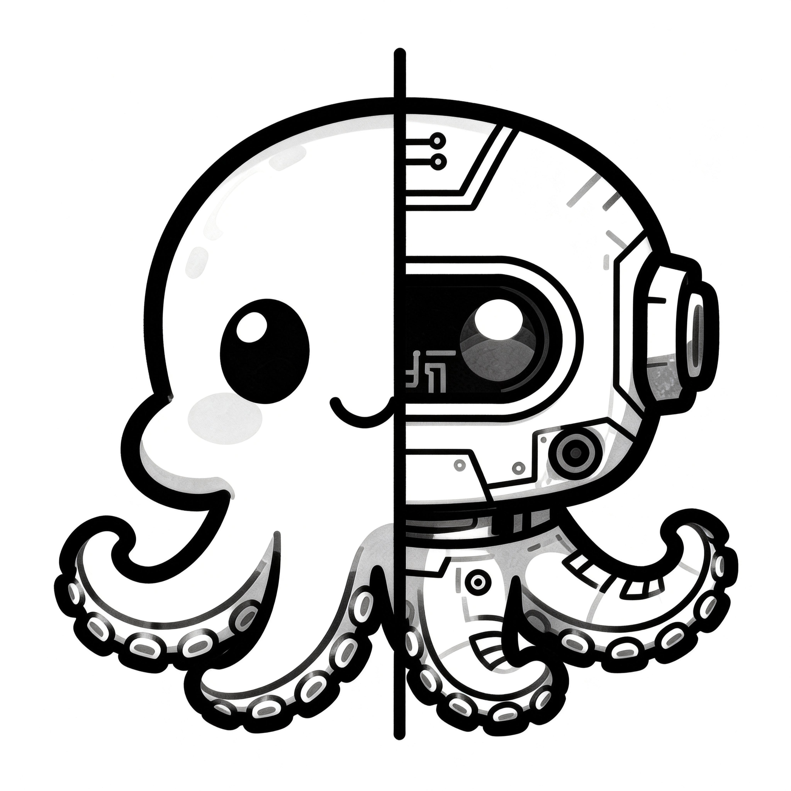

# Kraken AI Assistant (TypeScript)

<p align="center">
  
</p>

Kraken is a minimal ReAct-style AI assistant implemented in TypeScript. It features a soft sandbox for file access, an OpenAI-compatible LLM client with standard function calling, session compression via summarization, a tool execution system, and a MessageBus-based architecture for decoupled communication.

## Features
- ReAct loop with tool execution
- OpenAI standard function calling (compatible with all major LLM providers)
- MessageBus architecture for decoupled communication
- Soft sandbox for file access (allowlisted paths)
- OpenAI-style chat completions client (compatible providers)
- Session compression via summarization
- Built-in tools: `write_todo`, `read_file`, `web_fetch`, `browser`, `web_search`
- Modular CLI interface

## Quick start
```bash
npm install
npm run dev
```

## Configuration
Set environment variables (use `.env` or export in shell):

- `OPENAI_API_KEY` (required)
- `OPENAI_MODEL` (default: `gpt-4o-mini`)
- `OPENAI_BASE_URL` (optional, default: `https://api.openai.com/v1`)
- `OPENAI_SUMMARY_MODEL` (optional, defaults to `OPENAI_MODEL`)

### ReAct
- `REACT_MAX_STEPS` (default: `6`)
- `REACT_TEMPERATURE` (default: `0.2`)

### Session compression
- `MAX_SESSION_TOKENS` (default: `4000`)
- `SUMMARY_TARGET_TOKENS` (default: `600`)

### Sandbox
- `SANDBOX_ROOT` (default: `process.cwd()`)
- `SANDBOX_ALLOWED_DIRS` (comma-separated absolute paths)
- `SANDBOX_MAX_FILE_BYTES` (default: `1048576`)

### Network tools
- `ALLOW_NETWORK` set to `true` to enable `web_fetch` and `web_search`
- `WEB_SEARCH_ENDPOINT` (optional)
- `WEB_SEARCH_API_KEY` (optional)

## Notes on the sandbox
This is a **soft sandbox**: it restricts file access to allowlisted directories and limits file size, but does not provide OS-level isolation. For stronger isolation, wrap tool execution in a container or VM.

## Example usage
```bash
export OPENAI_API_KEY=your_key
export OPENAI_MODEL=gpt-4o-mini
npm run dev
```

## Project structure
```
src/
  cli/            # CLI interface
    CLI.ts        # CLI class with MessageBus listeners
    index.ts      # CLI factory function
  core/           # Core libraries
    agent/        # ReAct loop
    llm/          # OpenAI-compatible client
    messagebus/   # Event-based communication bus
    sandbox/      # soft sandbox
    session/      # session compression
    tools/        # tool registry + builtin tools
    utils/        # helpers
  index.ts        # Entry point
```

## Architecture

The project uses a MessageBus pattern for decoupled communication:
- **MessageBus**: Event emitter for communication between components
- **Agent**: Emits events (`agent:thinking`, `agent:tool_call`, `agent:tool_result`, `agent:response`, `agent:error`)
- **CLI**: Subscribes to MessageBus events and displays them to the user
- This architecture allows easy integration of alternative interfaces (web UI, API server, etc.)
